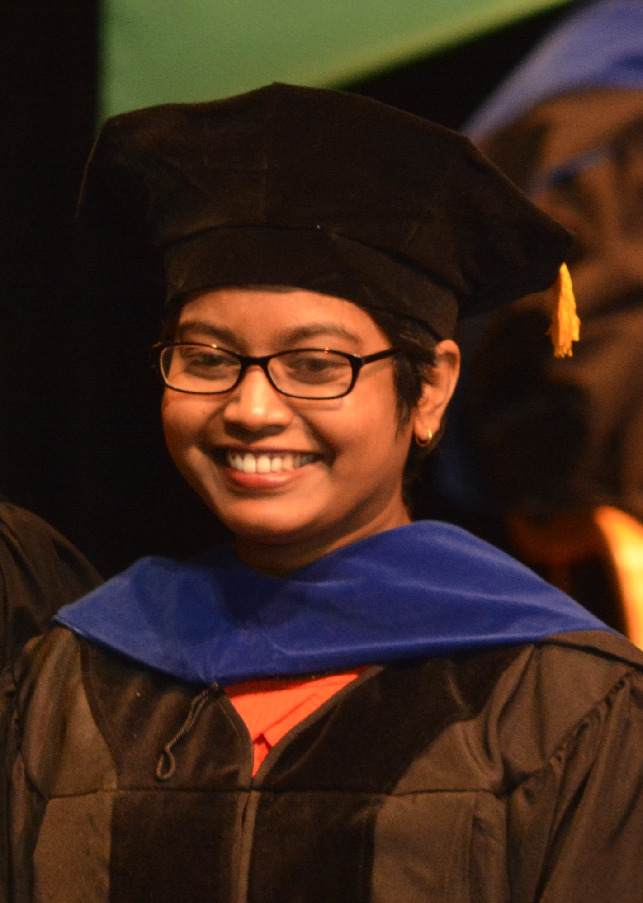

## Dinuni Fernando

I received Ph.D from the Department of Computer Science at Binghamton University. I worked at Security and Verification Research (SVR) Lab and Operating Systems and Networks Lab (OSNET), under Prof. Ping Yang and Prof. Kartik Gopalan . 

I obtained my B.Sc.(Hons) in University of Colombo School of Computing of Sri Lanka with First class honors, in 2014.

## Research Interest

Virtualization, Software-defined networking, Security
## Publications

+ Dinuni K Fernando, Jonathan Terner, Kartik Gopalan, Ping Yang," Live Migration Ate My VM: Recovering a Virtual Machine after Failure of Post-Copy Live Migration",in Proceedings of IEEE International Conference on Computer Communications (IEEE INFOCOM 2019), Paris, France, April 2019. (Acceptance rate: 288/1464 = 19.7%)

+ D. Fernando, K. D. Kang, Y. Zhou, "An Adaptive Closed-Loop Approach for Timely Data Services," In Proceedings of the 23rd IEEE International Conference on Embedded and Real-Time Computing Systems and Applications (RTCSA '17), August 16 - 18, 2017, Hsinchu, Taiwan.

+ D. Fernando, H. Bagdi, Y. Hu, P. Yang, K. Gopalan, C. Kamhoua, and K. Kwiat, Quick Eviction of Virtual Machines Through Proactive Live Snapshots, Full paper, IEEE/ACM International Conference on Utility and Cloud Computing (UCC) 2016(Acceptance rate: 18%)

+ Dinuni Fernando, Hardik Bagdi, Yaohui Hu, Ping Yang, Kartik Gopalan, Charles Kamhoua, and Kevin Kwiat, Quick Eviction of Virtual Machines Through Proactive Snapshots, Refereed Poster, IEEE International Conference on Cluster Computing (CLUSTER) 2016

+ Fernando, D; Kodikara, N; Keppetiyagama, C, "3D Radar – Modeling Virtual Maritime Environment For the Static Environment Perception", International Conference on Robotics, Biomimetics, Intelligent Computational Systems,ROBIONETICS 2013 .

+ Fernando, D; Kodikara, N; Keppetiyagama, C,"Mathematical Model for Radar in 3D Virtual Maritime Environment to Aid Dynamic Perception ",International Journal of Simulation Systems Science & Technology,(ijssst),14(4),2013.

+ Weerawarne, L.; Sayakkara, A.; Fernando, D.; Suduwella, C.; De Zoysa, K., "TikiriPower - Using TikiriDB abstraction on Smart Home systems," International Conference on Advances in ICT for Emerging Regions, (ICTer), 2012.

+ Udalagama, S.; Sahabandu, L.; Samarkoon, L.; Fernando, D.; Chanthirasegaran, P.; Udana, S.;Asanga, D.; Fernando, C.; Keppetiyagama, C.; Ranasinghe, C., "A sustainable mechanism for gathering road traffic data using smart-phones," Advances in ICT for Emerging Regions (ICTer), 2012

## Awards/Honors
+ NSF-supported travel Grant Recipient for IEEE INFOCOM 2019

+ NSF-supported travel Grant Recipient for CLUSTER 2016

+ Most Outstanding Graduate of the year 2014 (UCSC)- Prof. V.K Samaranayake Memorial Gold medal

## Press Release
NSF $1 million grant for my latest project with Prof. Yang

## Experiences
+ Graduate Research Assistant (Fall 2014, Spring 2015 ,Summer 2015, Fall 2015,Summer 2016,Summer 2017,Fall 2017 )

+ Graduate Teaching Assistant (Spring 2016, Fall 2016, Spring 2017 )

+ Professional Activities

+ Externel Reviewer in SSCC-2016, CCGrid-2017, ICDCS-2017

+ The President of (Graduate Student Organization of Computer Science) GSOCS (2017-2018)

+ The Vice President of (Graduate Student Organization of Computer Science) GSOCS (2016-2017)

+ The senator of (Graduate Student Associated of Computer Science) GSOCS for GSO Binghamton university (2016-2017)

+ The Chairperson of IEEE student branch of UCSC (2013-2014)

+ The Coordinator of IEEE student branch of UCSC (2011-2013)

---

